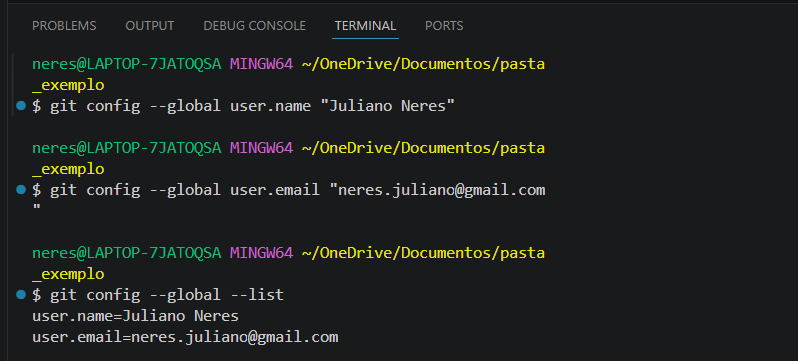
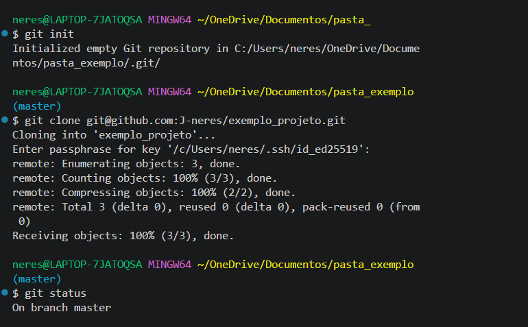

<div align="center">


<br>


# Manual de Git & GitHub
### Guia prático dos principais comandos usados no dia a dia

*Guia ideal para quem está começando ou quer relembrar os comandos essenciais*

</div>

---

## 📑 Sumário

- [O que é Git e GitHub](#-o-que-é-git-e-github)
- [Terminais: onde rodar os comandos](#-terminais-onde-rodar-os-comandos)
- [Configuração inicial](#-configuração-inicial)
- [Criar e visualizar status do repositório](#-criar-e-visualizar-status-do-repositório)
- [O fluxo básico: add → commit](#-o-fluxo-básico-add--commit)
- [Histórico e diferenças](#-histórico-e-diferenças)
- [Branches (ramificações)](#-branches-ramificações)
- [Desfazendo mudanças](#-desfazendo-mudanças-checkout-revert-e-reset)
- [Conectando com o GitHub (SSH)](#-conectando-com-o-github-ssh)
- [Outros comandos úteis](#-outros-comandos)
- [Glossário](#-glossário)
- [Fluxo completo](#-fluxo-completo)
- [Bônus: Comparativo CMD × PowerShell × Git Bash](COMPARATIVO-TERMINAIS.md)

---

  <br>

  ## 🧩 O que é Git e GitHub?

| | O que é |
|---|---|
| **Git** | Um sistema de controle de versão. Ele guarda o histórico de tudo o que você muda em um projeto, permitindo voltar no tempo, comparar versões e trabalhar em paralelo com outras pessoas. Roda **na sua máquina**. |
| **GitHub** | Uma plataforma na nuvem que hospeda repositórios Git. É onde você guarda uma cópia do seu projeto online, colabora com outras pessoas e monta seu portfólio. |

> 💡 **Resumindo:** O Git permite controlar e guardar "localmente" todos os marcos do seu trabalho, para você poder voltar no tempo, se precisar. E o GitHub é um site na internet onde você guarda esse trabalho, deixando disponível para outras pessoas colaborarem de qualquer lugar e a qualquer momento...

---
<br>

## 💻 Terminais: onde rodar os comandos

No Windows, você pode usar três terminais diferentes. Todos rodam comandos Git, mas se comportam de forma diferente entre si.

| Terminal | Como reconhecer | Observação |
|---|---|---|
| **CMD** | `C:\Users\usuario>` | Terminal antigo do Windows |
| **PowerShell** | `PS C:\Users\usuario>` | Terminal moderno do Windows |
| **Git Bash** | `usuario@PC MINGW64 ~` | Simula um terminal Linux — **recomendado para usar Git** |

> **Recomendação:** use o **Git Bash** (instalado junto com o Git). Os comandos Git funcionam de forma idêntica nele em qualquer sistema operacional, e é o padrão usado na maioria dos tutoriais.

---


<br>

## 🛠 Configuração inicial

Feita **uma única vez** — define quem é o autor dos seus commits.

```bash
git config --global user.name "Seu Nome"
git config --global user.email "seu@email.com"
```

Para conferir as configurações salvas:

```bash
git config --global --list
```



---


 <br>
 
## 📂 Criar e visualizar status do repositório

| Comando | O que faz |
|---|---|
| `git init` | Transforma a pasta atual em um repositório Git |
| `git clone <endereço>` | Copia um repositório existente do GitHub para sua máquina |
| `git status` | Mostra o que mudou: arquivos modificados, novos ou prontos para commit |

```bash
git init
git clone git@github.com:usuario/repositorio.git
git status
```
*Obs: Após o "git clone", caso seja pedido, insira a senha definida inicialmente.*

#### Exemplo:


---

 <br>

## 🔁 O fluxo básico: add → commit

Esses são alguns dos comandos mais usados no dia a dia. Todo projeto segue esse ciclo:

```
 Você edita arquivos  →  git add  →  git commit  →  git push
```

| Comando | O que faz |
|---|---|
| `git add nome_arquivo` | Prepara um arquivo específico para o commit ("stage") |
| `git add .` | Prepara **todos** os arquivos modificados |
| `git commit -m "mensagem"` | Salva as mudanças com uma mensagem explicando o que foi feito |

```bash
git add .
git commit -m "Adiciona página inicial do site"
```

> 💡 **Por que existe o "add" antes do "commit"?** Ele permite escolher exatamente o que vai entrar em cada commit, ao invés de salvar tudo de uma vez sem controle.

---


<br>

## 📜 Histórico e diferenças

| Comando | O que faz |
|---|---|
| `git log` | Mostra o histórico completo de commits |
| `git log --oneline` | Histórico resumido, um commit por linha |
| `git log --graph --oneline --all` | Histórico visual, mostrando branches |
| `git diff` | Mostra o que mudou nos arquivos ainda não commitados |

```bash
git log --oneline
```

---


<br>
 
## 🌿 Branches (ramificações)

Branches permitem testar ideias ou desenvolver funcionalidades **sem afetar** a versão principal do projeto.

```
main   ──●──●──●───────────●──
              \             /
feature        ●──●──●──●──   (mesclada de volta com merge)
```

| Comando | O que faz |
|---|---|
| `git branch` | Lista as branches existentes |
| `git branch nome` | Cria uma nova branch |
| `git checkout nome` | Muda para outra branch |
| `git checkout -b nome` | Cria e já muda para a nova branch |
| `git merge nome` | Mescla a branch informada com a branch atual |

```bash
git checkout -b nova-funcionalidade
# ... trabalha e commita normalmente ...
git checkout main
git merge nova-funcionalidade
```

---


<br>

## 🔄 Desfazendo mudanças: `checkout`, `revert` e `reset`

| Comando | Função | Altera o histórico? | Seguro após `push`? |
|---|---|---|---|
| `checkout` | Navega entre branches ou descarta mudanças locais | Não | ✅ Sim |
| `revert` | Cria um novo commit desfazendo outro | Não (adiciona) | ✅ Sim — o mais seguro |
| `reset` | Move a branch de volta, podendo apagar mudanças | Sim | ⚠️ Arriscado |

```bash
# Desfazer mudanças não commitadas em um arquivo
git checkout -- arquivo.css

# Desfazer um commit já enviado, mantendo o histórico visível
git revert <hash_do_commit>

# Voltar commits localmente (ainda não enviados)
git reset --soft HEAD~1    # mantém as mudanças no stage
git reset --hard HEAD~1    # ⚠️ apaga as mudanças completamente
```

> **Regra prática:** já fez `push`? Use `revert`. Ainda está só na sua máquina? Use `reset` (Mas sempre com atenção!).

---


<br>

## 🔗 Conectando com o GitHub (SSH)

### 1. Conectar um repositório local a um repositório remoto

```bash
git remote add origin git@github.com:usuario/repositorio.git
```
> `origin` é o apelido padrão usado para representar o endereço do repositório remoto.

### 2. Conferir os endereços conectados

```bash
git remote -v
```

### 3. Enviar mudanças para o GitHub

```bash
git push origin main
```

### 4. Baixar mudanças do GitHub

```bash
git pull origin main
```

### 5. Clonar um repositório existente

```bash
git clone git@github.com:usuario/repositorio.git
```

---


<br>

## 🔡 Outros comandos

| Comando | O que faz |
|---|---|
| `git stash` | Guarda mudanças não commitadas temporariamente, sem perder nada |
| `git stash pop` | Recupera as mudanças guardadas com `stash` |
| `git tag v1.0` | Marca um commit específico (ex: uma versão do projeto) |
| `git rm arquivo` | Remove um arquivo do projeto e do controle do Git |
| `git fetch` | Busca mudanças do repositório remoto sem aplicá-las ainda |

---


<br>

## 📖 Glossário

| Termo | Significado |
|---|---|
| **Repositório (repo)** | Pasta do projeto controlada pelo Git |
| **Commit** | Um "retrato" salvo do projeto em um momento específico |
| **Stage / Index** | Área intermediária onde você prepara o que vai entrar no próximo commit |
| **Branch** | Uma linha paralela de desenvolvimento |
| **Merge** | Ação de unir duas branches |
| **Push** | Enviar commits locais para o repositório remoto |
| **Pull** | Trazer e aplicar mudanças do repositório remoto |
| **Clone** | Copiar um repositório remoto inteiro para a máquina local |
| **Origin** | Apelido padrão para o endereço do repositório remoto |
| **Upstream** | Vínculo entre a branch local e a branch remota correspondente |

---


<br>

## ✅ Fluxo completo

Do zero até o primeiro envio para o GitHub:

```bash
# 1. Configurar (uma vez só)
git config --global user.name "Seu Nome"
git config --global user.email "seu@email.com"

# 2. Iniciar o projeto
git init

# 3. Conectar ao GitHub
git remote add origin git@github.com:usuario/repositorio.git

# 4. Trabalhar no projeto
git add .
git commit -m "primeiro commit"

# 5. Enviar para o GitHub
git push -u origin main
```

Depois disso, o dia a dia se resume a:

```bash
git status
git add .
git commit -m "descrição da mudança"
git push
```

---


<br>

## 📄 Comparativo de terminais

Se preferir usar outros terminais (CMD ou PowerShell), ao invés do Git Bash, acesse o **Comparativo de Terminais** para visualizar os comandos equivalentes entre **CMD, PowerShell e Git Bash**:

➡️ **[Ver Comparativo CMD × PowerShell × Git Bash](COMPARATIVO-TERMINAIS.md)**

---

<div align="center">

*Manual criado para consulta rápida e compartilhamento. Fique a vontade para usar, adaptar e compartilhar.*

<br></br>
⭐ Se este projeto foi útil para você, considere deixar uma estrela no repositório 🤝🏼
</div>
